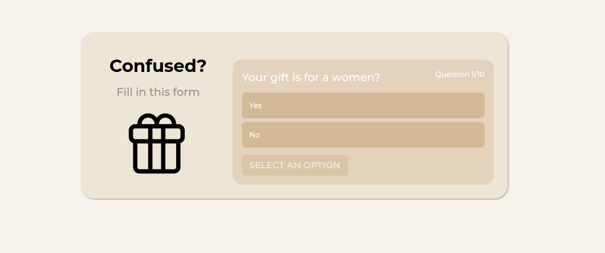
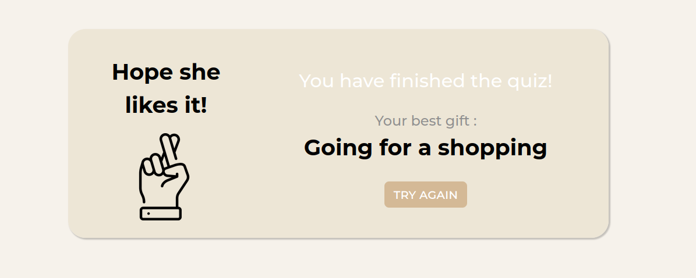

# Project guide

## Overview

This project is an expert system designed to assist you in selecting the best gift to offer, based on your answers, developped with VueJs and Django.

## Manual Setup

<blockquote> <p dir="auto">You can avoid this configurational step by using the <a href="#docker-setup">Docker installation process</a>.</p></blockquote>

### Install required dependencies

Perform the following steps:

1- Download and install <a href="https://nodejs.org/en/">Node.js</a>.<br/>
2- Download and install <a href="https://www.python.org/">Python (>= 3.9)</a>.<br/>
3- Install <strong>Vetur, Better Comments, Docker, Python, GitHub Theme </strong> extensions for VS Code To enjoy the code.<br/>
4- Clone the project.<br/>
5- Install frontend requirements :

```bash
cd Expert-System-Gift-Recommendation\App\frontend
npm install
```
6- Install backend requirements :
```bash
cd Expert-System-Gift-Recommendation\App\Dockerfiles
pip3 install --no-cache-dir -r requirements.txt
```
7- run the frontend :
```bash
cd Expert-System-Gift-Recommendation\App\frontend
npm run serve
```
8- run the backend server :
```bash
cd Expert-System-Gift-Recommendation\App\backend
python3 app.py
```
Now, You can now access the server at http://localhost:8080/

<h2 tabindex="-1" dir="auto"><a id="user-content-docker-setup" class="anchor" aria-hidden="true" href="#docker-setup"></a>Docker Setup</h2>
<blockquote>
<p dir="auto">Make sure Docker is installed.</p>
</blockquote>
<p dir="auto">Spin up the containers</p>

```
docker-compose up -d --build
```
Running the command will expose 7 services with the following ports:
<ul dir="auto">
<li><strong>Backend</strong> - <code>:5000</code></li>
<li><strong>Frontend</strong> - <code>:8080</code></li>
</ul>

You can now access the server at http://localhost:8080/.

## Interfaces of the application

Question example:



Result:


